# Trabajo Práctico 4: Bases de Datos, SQL y Manejo de Versiones

**Alumnos:** 
- Juan Bautista Gramaglia, legajo: 63.389
- Micaela Rocío Tedesco, legajo: 61.584

## **PARTE 1:** Bases de Datos

### 1. ¿Qué tipo de base de datos es? Clasificarla según estructura y función.

Respuesta

### 2. Planteando el Modelo conceptual, armar el diagrama entidad-relación de la base de datos dada. (Usar notación de Chen, marcando tipo de participación, cardinalidad, claves primarias y parciales).


### 3. Mapear del Modelo conceptual planteado en el punto 2 al Modelo Relacional la base de datos dada. (Usar notación Crow’s foot en el diagrama).


### 4. ¿Considera que la base de datos está normalizada? En caso que no lo esté, ¿cómo podría hacerlo?

Respuesta

## **PARTE 2:** SQL

### 1. Cuando se realizan consultas sobre la tabla paciente agrupando por ciudad los tiempos de respuesta son demasiado largos. Proponer mediante una query SQL una solución a este problema.

```
CREATE INDEX idx_ciudad ON pacientes(ciudad);

SELECT ciudad, COUNT(id_paciente) AS cantidad_pacientes
FROM pacientes
GROUP BY ciudad;
```
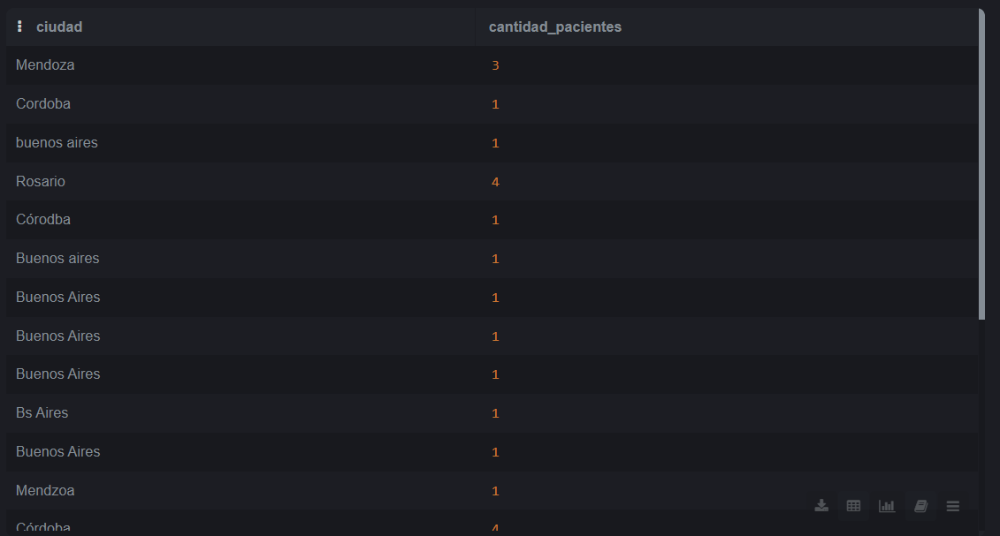

### 2. Se tiene la fecha de nacimiento de los pacientes. Se desea calcular la edad de los pacientes y almacenarla de forma dinámica en el sistema ya que es un valor típicamente consultado, junto con otra información relevante del paciente.
```
CREATE OR REPLACE VIEW edad_pacientes AS
SELECT 
    id_paciente,
    nombre AS nombre_paciente,
    fecha_nacimiento,
    EXTRACT(YEAR FROM AGE(CURRENT_DATE, fecha_nacimiento)) AS edad,
    id_sexo,
    numero,
    calle,
    ciudad
FROM pacientes;

SELECT * FROM edad_pacientes;
```
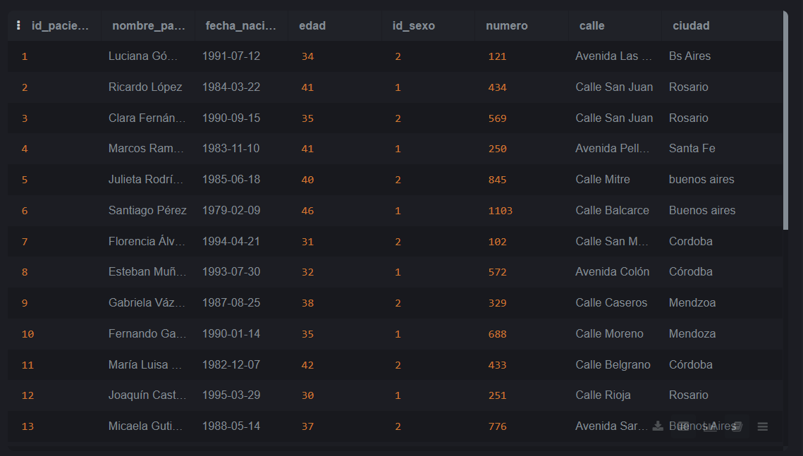
### 3. La paciente, “Luciana Gómez”, ha cambiado de dirección. Antes vivía en “Avenida Las Heras 121” en “Buenos Aires”, pero ahora vive en “Calle Corrientes 500” en “Buenos Aires”. Actualizar la dirección de este paciente en la base de datos.
```
UPDATE pacientes SET calle = 'Calle Corrientes', numero = 500, ciudad = 'Buenos Aires' WHERE nombre = 'Luciana Gómez';
```


### 4. Seleccionar el nombre y la matrícula de cada médico cuya especialidad sea identificada por el id 4.
```
SELECT nombre AS nombre_medico, matricula FROM medicos WHERE especialidad_id = 4;
```


### 5.  Puede pasar que haya inconsistencias en la forma en la que están escritos los nombres de las ciudades, ¿cómo se corrige esto? Agregar la query correspondiente.
```
#OPCIÓN 1
SELECT *, CASE
WHEN LOWER(SUBSTRING(trim(ciudad),1,1)) = 'r' THEN 'Rosario'
WHEN LOWER(SUBSTRING(trim(ciudad),1,1)) = 's' THEN 'Santa Fe'
WHEN LOWER(SUBSTRING(trim(ciudad),1,1)) = 'b' THEN 'Buenos Aires'
WHEN LOWER(SUBSTRING(trim(ciudad),1,1)) = 'c' THEN 'Cordoba'
ELSE 'Mendoza'
END AS ciudades_corregidas
FROM pacientes;
```
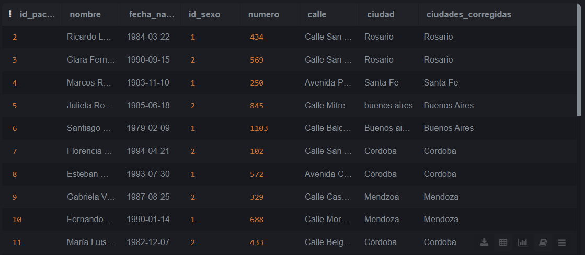
```
#OPCIÓN 2
UPDATE pacientes SET ciudad = CASE
WHEN LOWER(SUBSTRING(trim(ciudad),1,1)) = 'r' THEN 'Rosario'
WHEN LOWER(SUBSTRING(trim(ciudad),1,1)) = 's' THEN 'Santa Fe'
WHEN LOWER(SUBSTRING(trim(ciudad),1,1)) = 'b' THEN 'Buenos Aires'
WHEN LOWER(SUBSTRING(trim(ciudad),1,1)) = 'c' THEN 'Cordoba'
ELSE 'Mendoza'
END;
```
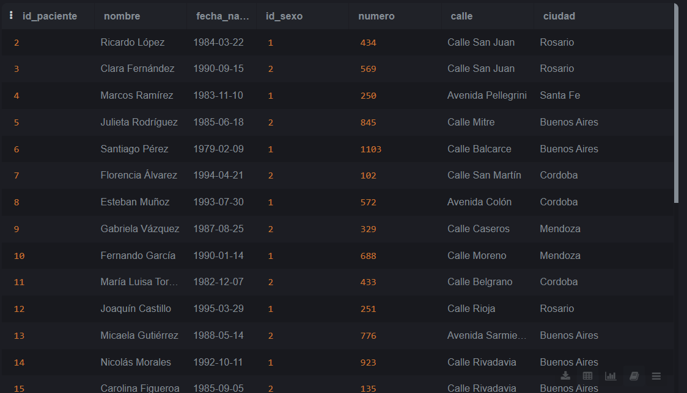
### 6.  Obtener el nombre y la dirección de los pacientes que viven en Buenos Aires.
```
SELECT nombre AS nombre_paciente, numero, calle FROM pacientes WHERE ciudad = 'Buenos Aires'
```
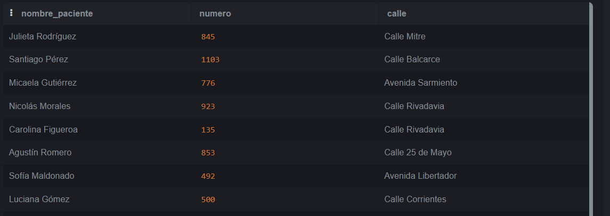
### 7. Cantidad de pacientes que viven en cada ciudad.
```
SELECT ciudad, COUNT(id_paciente) AS cantidad_pacientes FROM pacientes GROUP BY ciudad ORDER BY cantidad_pacientes ASC;
```

### 8. Cantidad de pacientes por sexo que viven en cada ciudad.
```
SELECT pacientes.ciudad, sexobiologico.descripcion AS sexo, COUNT(pacientes.id_paciente) AS cantidad_pacientes
FROM sexobiologico
RIGHT JOIN pacientes
ON sexobiologico.id_sexo = pacientes.id_sexo
GROUP BY pacientes.ciudad, sexobiologico.descripcion
ORDER BY pacientes.ciudad asc;
```
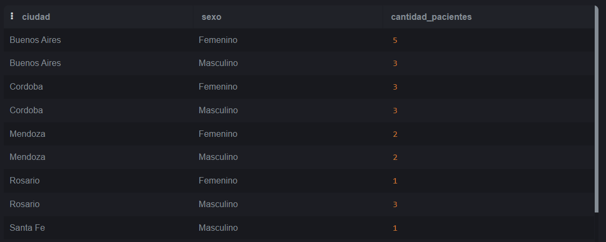
### 9. Obtener la cantidad de recetas emitidas por cada médico.
```
SELECT medicos.nombre AS nombre_medico, COUNT(recetas.id_receta) AS cantidad_recetas
FROM medicos
RIGHT JOIN recetas
ON medicos.id_medico = recetas.id_medico
GROUP BY medicos.id_medico
ORDER BY cantidad_recetas asc;
```

### 10. Obtener todas las consultas médicas realizadas por el médico con ID igual a 3 durante el mes de agosto de 2024.
```
SELECT *
FROM consultas
WHERE id_medico = 3 AND fecha BETWEEN '2024-08-01' AND '2024-08-31';
```
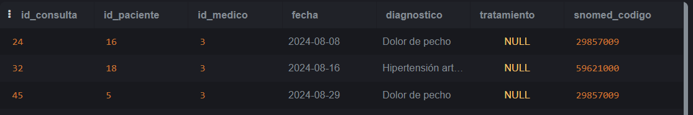
### 11. Obtener el nombre de los pacientes junto con la fecha y el diagnóstico de todas las consultas médicas realizadas en agosto del 2024.
```
SELECT pacientes.nombre AS nombre_paciente, consultas.fecha , consultas.diagnostico
FROM pacientes
RIGHT JOIN consultas
ON pacientes.id_paciente = consultas.id_paciente
WHERE fecha BETWEEN '2024-08-01' AND '2024-08-31';
```
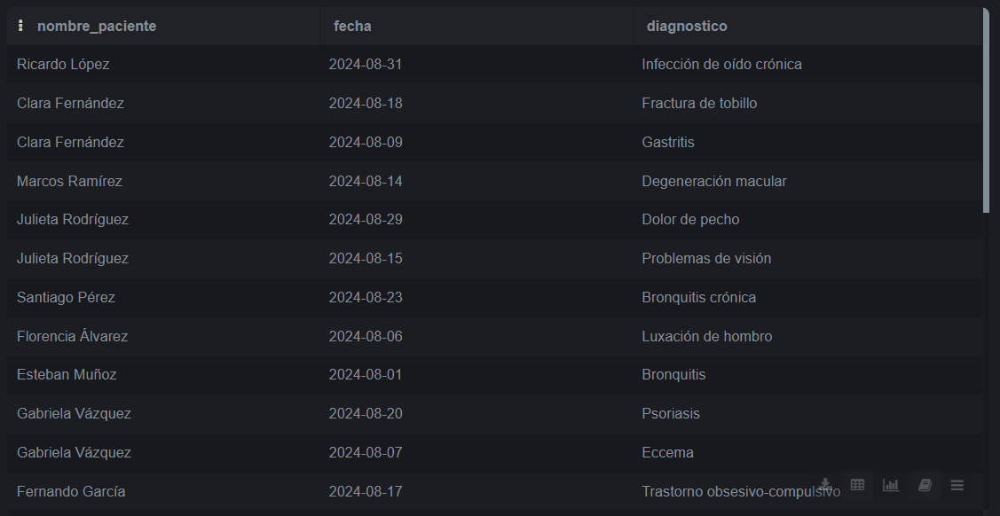
### 12. Obtener el nombre de los medicamentos prescritos más de una vez por el médico con ID igual a 2.
```
SELECT medicamentos.nombre AS nombre_medicamento, COUNT(recetas.id_receta) AS cantidad_recetas
FROM recetas
LEFT JOIN medicamentos
ON medicamentos.id_medicamento = recetas.id_medicamento
WHERE recetas.id_medico = 2
GROUP BY medicamentos.id_medicamento
HAVING COUNT(recetas.id_receta) > 1;
```

### 13.  Obtener el nombre de los pacientes junto con la cantidad total de recetas que han recibido.
```
SELECT pacientes.nombre AS nombre_paciente, COUNT(recetas.id_receta) AS total_recetas
FROM recetas
LEFT JOIN pacientes
ON recetas.id_paciente = pacientes.id_paciente
GROUP BY pacientes.id_paciente
ORDER BY total_recetas ASC;
```
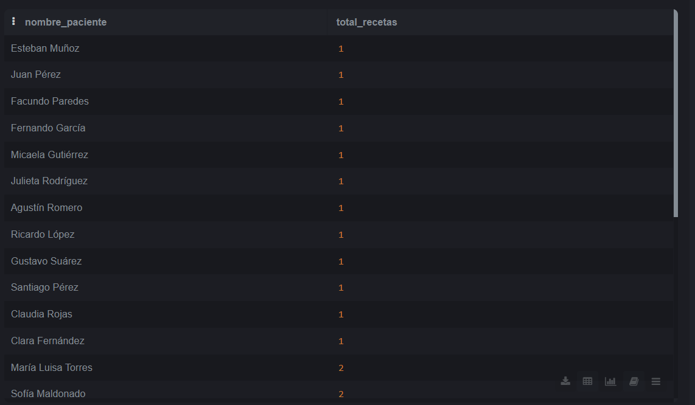
### 14. Obtener el nombre del medicamento más recetado junto con la cantidad de recetas emitidas para ese medicamento.
```
SELECT medicamentos.nombre AS nombre_medicamento, COUNT(recetas.id_receta) AS total_recetas
FROM recetas
LEFT JOIN medicamentos
ON recetas.id_medicamento = medicamentos.id_medicamento
GROUP BY medicamentos.id_medicamento
ORDER BY total_recetas DESC
LIMIT 1;
```

### 15. Obtener el nombre del paciente junto con la fecha de su última consulta y el diagnóstico asociado.
```
SELECT pacientes.nombre AS nombre_paciente, consultas.fecha AS ultima_consulta, consultas.diagnostico
FROM consultas
LEFT JOIN pacientes
ON consultas.id_paciente = pacientes.id_paciente
WHERE consultas.fecha = (SELECT MAX(consultas2.fecha) FROM consultas consultas2 WHERE consultas.id_paciente = consultas2.id_paciente)
ORDER BY pacientes.nombre;
```
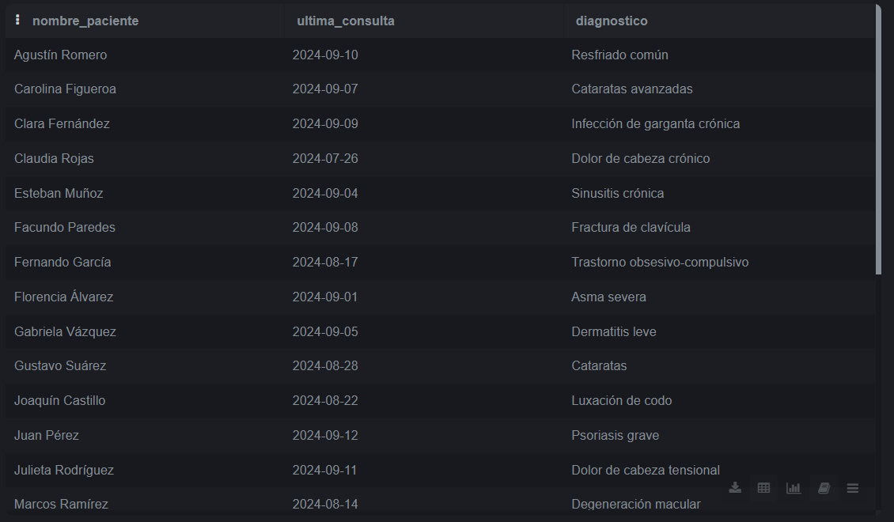
### 16. Obtener el nombre del médico junto con el nombre del paciente y el número total de consultas realizadas por cada médico para cada paciente, ordenado por médico y paciente.
```
SELECT medicos.nombre AS nombre_medico, pacientes.nombre AS nombre_paciente, COUNT(consultas.id_consulta) AS cantidad_consultas
FROM consultas
Inner JOIN medicos
ON consultas.id_medico = medicos.id_medico
INNER JOIN pacientes
ON consultas.id_paciente = pacientes.id_paciente
GROUP BY medicos.id_medico, pacientes.id_paciente
ORDER BY medicos.nombre, pacientes.nombre;
```
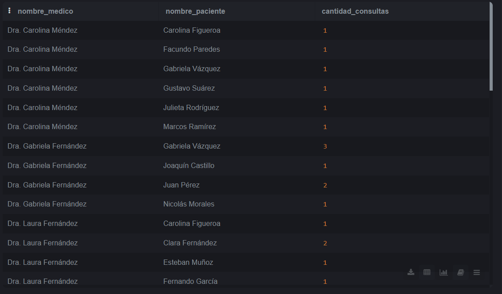
### 17. Obtener el nombre del medicamento junto con el total de recetas prescritas para ese medicamento, el nombre del médico que lo recetó y el nombre del paciente al que se le recetó, ordenado por total de recetas en orden descendente.
```
SELECT 
    medicamentos.nombre AS nombre_medicamento,
    t.total_recetas AS total_recetas,
    medicos.nombre AS nombre_medico,
    pacientes.nombre AS nombre_paciente
FROM recetas
INNER JOIN medicamentos
    ON recetas.id_medicamento = medicamentos.id_medicamento
INNER JOIN medicos
    ON recetas.id_medico = medicos.id_medico
INNER JOIN pacientes
    ON recetas.id_paciente = pacientes.id_paciente
INNER JOIN (
    SELECT id_medicamento, COUNT(*) AS total_recetas
    FROM recetas
    GROUP BY id_medicamento
) AS t ON recetas.id_medicamento = t.id_medicamento
ORDER BY t.total_recetas DESC, nombre_medicamento;
```
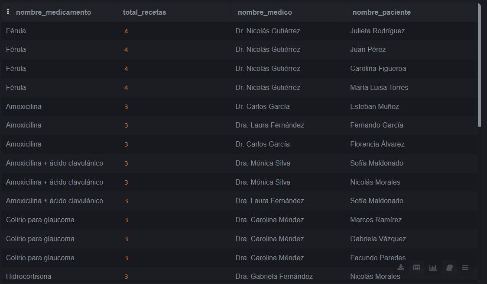
### 18. Obtener el nombre del médico junto con el total de pacientes a los que ha atendido, ordenado por el total de pacientes en orden descendente.
```
SELECT medicos.nombre AS nombre_medico, COUNT(DISTINCT(consultas.id_paciente)) AS pacientes_atendidos
FROM medicos 
INNER JOIN consultas
ON medicos.id_medico = consultas.id_medico
INNER JOIN pacientes
ON consultas.id_paciente = pacientes.id_paciente
GROUP BY medicos.id_medico
ORDER BY pacientes_atendidos DESC;
```

